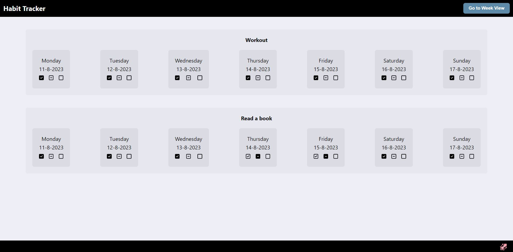

# React Habit Tracker Project

Access this project live here --> https://vibhavk03.github.io/react-habit-tracker/<br>


- this is a simple habit tracker SPA made using React<br>
- filling in the input box and clicking on Add Habit will add a new habit to the page<br>
- status of the habit can be changed for the last 7 days by going to the detail view<br>


- 3 statuses can be toggled for a habit - done, not done, and no action for that day which is the default status<br>
- last week completed count for the habit will be visible on the home page
- detail view for all the habits is visible when the Week View button is clicked from the header<br>
- clicking on the Remove Habit button will delete the habit from the app<br>



## Tech Stack

- this project uses React library for building this Habit Tracker SPA<br>
- styling is done using vanilla CSS<br>

## Technical Solutioning

- this project uses react-router-dom package to manage routing of requests<br>
- reduxjs/toolkit is used for simplifying the state management<br>

## Local Machine Setup

To run this application in your local machine, please follow the below steps.

1 - Clone the repository using the following command

```
git clone https://github.com/vibhavk03/react-habit-tracker.git
```

2 - Install the required dependencies using the following command

```
npm install
```

3 - Start the application using the following command

```
npm run start
```

4 - Open the application in your web browser by going to the below URL

```
http://localhost:3000/
```
